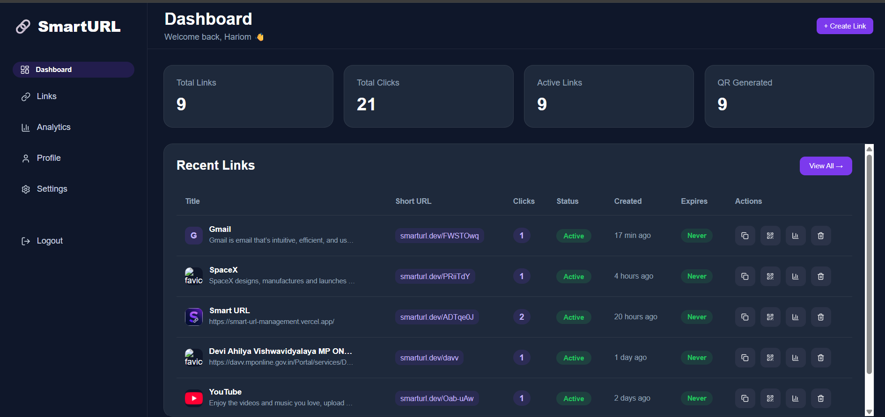
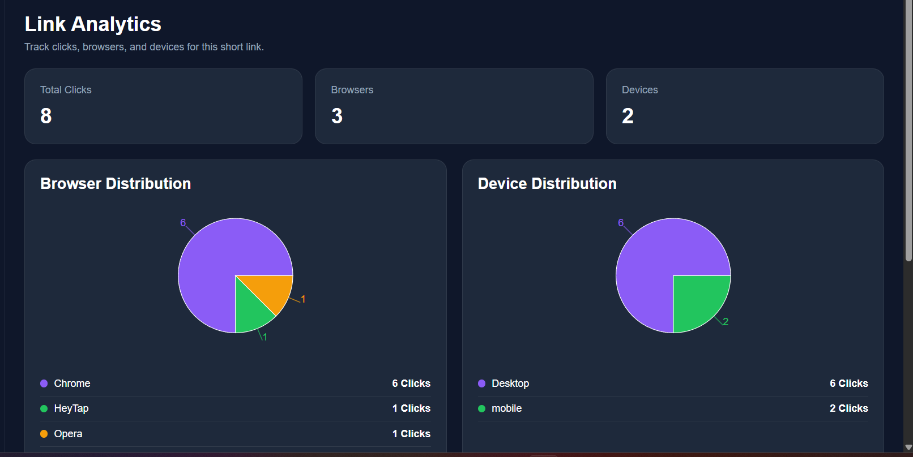
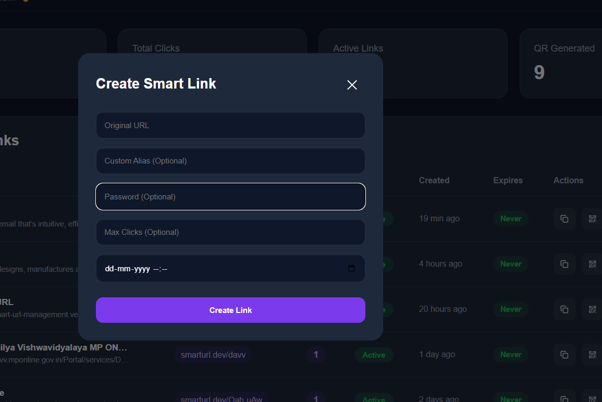
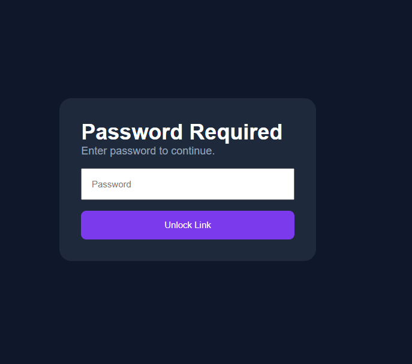

<div align="center">

# 🚀 SmartURL – Intelligent URL Management Platform

A production-grade Smart URL Management Platform built with React, TypeScript, Node.js, Express, PostgreSQL, and JWT Authentication.


</div>

> A production-grade Smart URL Management Platform built with React, TypeScript, Node.js, Express, PostgreSQL, and JWT Authentication.

Create secure, trackable, and intelligent short links with advanced analytics, QR code generation, password protection, expiration rules, click limits, and rich metadata.

---

## 📸 Screenshots

### Dashboard



### Analytics



### Create Link



### Password Protected Link



- Dashboard
- Links Page
- Analytics
- Create Link Modal
- QR Code
- Password Protected Link

---

# ✨ Features

## 🔐 Authentication

- JWT Authentication
- Secure Login
- User Registration
- Protected Routes
- User-specific data isolation

---

## 🔗 Smart URL Management

- Create Short URLs
- Custom Alias Support
- Automatic Short Code Generation
- Link Activation / Deactivation
- Delete Links

---

## 🛡 Security Features

- Password Protected Links
- Link Expiration
- Maximum Click Limit
- User-specific ownership
- JWT Protected APIs

---

## 📊 Advanced Analytics

Track every click including:

- Total Clicks
- Browser Analytics
- Device Analytics
- Operating System Analytics
- Click Timeline
- Recent Click Logs

---

## 🌐 Metadata Extraction

Automatically fetches

- Website Title
- Description
- Favicon
- Preview Image

using Cheerio.

---

## 📱 QR Code Support

Automatically generates QR codes for every Smart URL.

---

## 🎯 Redirect Engine

Supports intelligent redirect handling with

- Password Verification
- Expired Link Detection
- Maximum Click Validation
- Secure Redirect

---

# 🏗 Tech Stack

## Frontend

- React
- TypeScript
- React Router
- Axios
- Recharts
- Framer Motion
- Lucide React

---

## Backend

- Node.js
- Express.js
- TypeScript
- PostgreSQL
- JWT
- bcrypt
- UA Parser
- Cheerio
- QRCode

---

## Database

PostgreSQL

Tables

- users
- urls
- click_logs

---

## Deployment

Frontend

- Vercel

Backend

- Render

Database

- Neon PostgreSQL

---

# 📂 Project Structure

```
SmartURL
│
├── frontend
│   ├── src
│   ├── public
│   └── components
│
├── backend
│   ├── controllers
│   ├── routes
│   ├── middleware
│   ├── db
│   ├── utils
│   └── qr
```

---

# ⚙ Installation

Clone repository

```bash
git clone https://github.com/yourusername/smart-url-management.git
```

Backend

```bash
cd backend

npm install

npm run dev
```

Frontend

```bash
cd frontend

npm install

npm run dev
```

---

# 🔑 Environment Variables

Backend

```env
DATABASE_URL=

JWT_SECRET=

BASE_URL=
```

Frontend

```env
VITE_API_URL=
```

---

# 📈 Database Schema

## users

```
id
username
email
password
created_at
```

---

## urls

```
id
user_id
original_url
short_code
custom_alias
title
description
favicon
preview_image
password_hash
expires_at
click_count
max_clicks
is_active
qr_code
created_at
```

---

## click_logs

```
id
url_id
ip_address
browser
device_type
operating_system
referrer
clicked_at
```

---

# 🔄 Request Flow

```
User

↓

Frontend

↓

Backend

↓

PostgreSQL

↓

Analytics

↓

Redirect
```

---

# 📊 Analytics Pipeline

```
Open Link

↓

Redirect API

↓

Increase Click Count

↓

Store Click Log

↓

Detect Browser

↓

Detect Device

↓

Detect OS

↓

Analytics Dashboard
```

---

# 🔒 Security

- JWT Authentication
- bcrypt Password Hashing
- Protected APIs
- User Authorization
- Password Protected URLs
- Expiration Validation
- Click Limit Validation

---

# 🚀 API Overview

Authentication

```
POST /api/auth/register

POST /api/auth/login
```

Links

```
POST /api/url/create

GET /api/url/my-links

GET /api/url/:shortCode

DELETE /api/url/:id
```

Password

```
POST /api/url/verify-password
```

Analytics

```
GET /api/url/:id/analytics
```

---

# 📊 Future Improvements

- Geo Analytics
- Geo Redirect
- Device Based Redirect
- AI Link Safety Scanner
- AI Metadata Generator
- Custom Domains
- Team Workspaces
- Bulk URL Import
- CSV Export
- Webhooks
- Public Analytics Page
- Dark/Light Themes
- Link Scheduling

---

# 👨‍💻 Author

Hari Om Pandey

B.Tech Information Technology

IET DAVV Indore

---

# ⭐ If you like this project

Give it a ⭐ on GitHub.